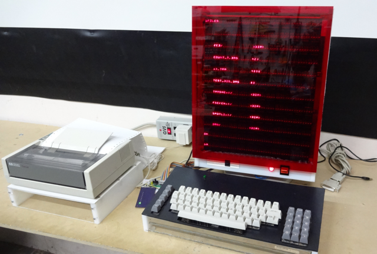
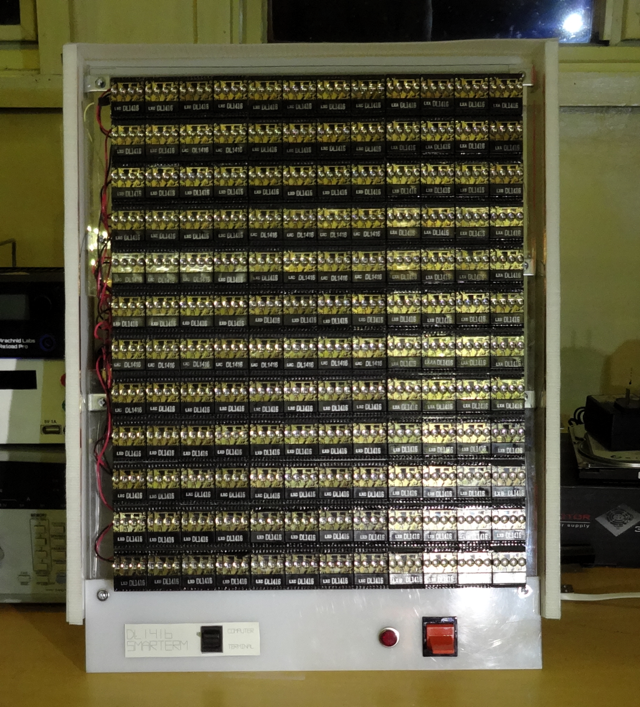
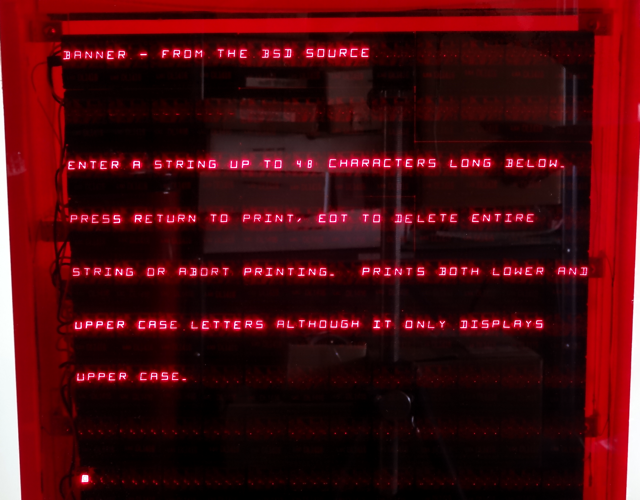

## DL1416SmarTerm

This repository contains the code for the DL1416SmarTerm retro-computer as documented on the [hackday.io](https://hackaday.io/project/17983-dl1416smarterm-led-computerterminal) site (along with [keyboard](https://hackaday.io/project/12796-almost-pre-historic-computer-keyboard-lives-again) and [printer](https://hackaday.io/project/18140-serial-to-parallel-printer-interface)).  These linked project pages contain source code and design files for the hardware components of this system.

The main DL1416SmarTerm code is designed to run on Teensy 3.1 (3.2) connected to a display made of Siemens DL1416B intelligent LED modules controlled by firmware running on PIC micro-controllers and a keyboard with a serial output.  The code is compiled using the Teensy Arduino
environment.

It provides both a VT102/220-ish compatible terminal and Tiny Basic (based on Scott Lawrence's version of Mike Field's port) selectable by switch (digital input) with printer support and a host interface over both a TTL serial port or a USB CDC class serial interface.  Tiny Basic provides 9 IO ports for user access, each including both digital IO and analog input.  Three of the IO ports also provide PWM output.  Finally Tiny Basic has been extended with commands to use the [Teensy Audio Library](https://www.pjrc.com/teensy/td_libs_Audio.html) for sound output.

Unless you are building a replica of the DL1416SmarTerm it's unlikely this code will be useful as-is.  However it's offered in the spirit of open-source.  Maybe it will help some other project, for example a terminal driving some off-the-shelf intelligent LCD display and PS2 keyboard or even (I hope, someday) a Teensy with a built-in driver
for NTSC/PAL or VGA output.

## Demo Directory

The demo folder (and associated document) contains a version of the code designed for the computer to be run in an exhibition mode.  It now supports the idea of virtual hosts that interact with the terminal instead of a real host connected to USB or RS232.  It supports two virtual hosts. 1) an implementation of the famous AI ELIZA program for terminal mode and 2) an implementation of the BSD banner.c program for generating ASCII banners on a printer. The ELIZA module may be ported to other projects.  Virtual hosts are selected from the terminal's menu.

The demo directory supercedes the mainline code including fixes that aren't being backported to the original code.  It includes a compiler directive (DEMO_MODE) that causes Tiny Basic to try to load a program "DEMORUN.BAS" on boot and also resets after a period of inactivity.

### Questions?

Contact the author @ dan@danjuliodesigns.com
